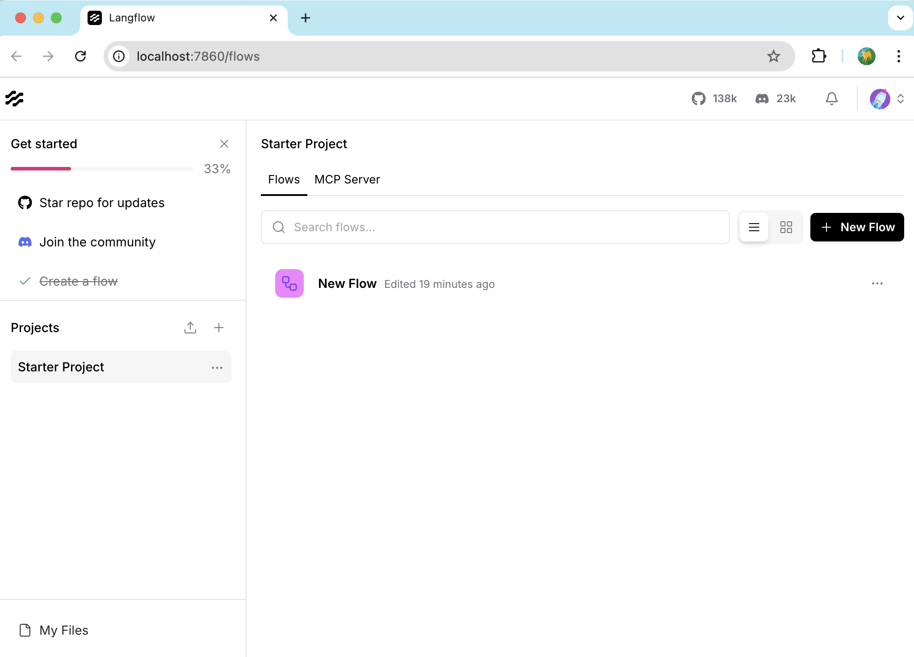
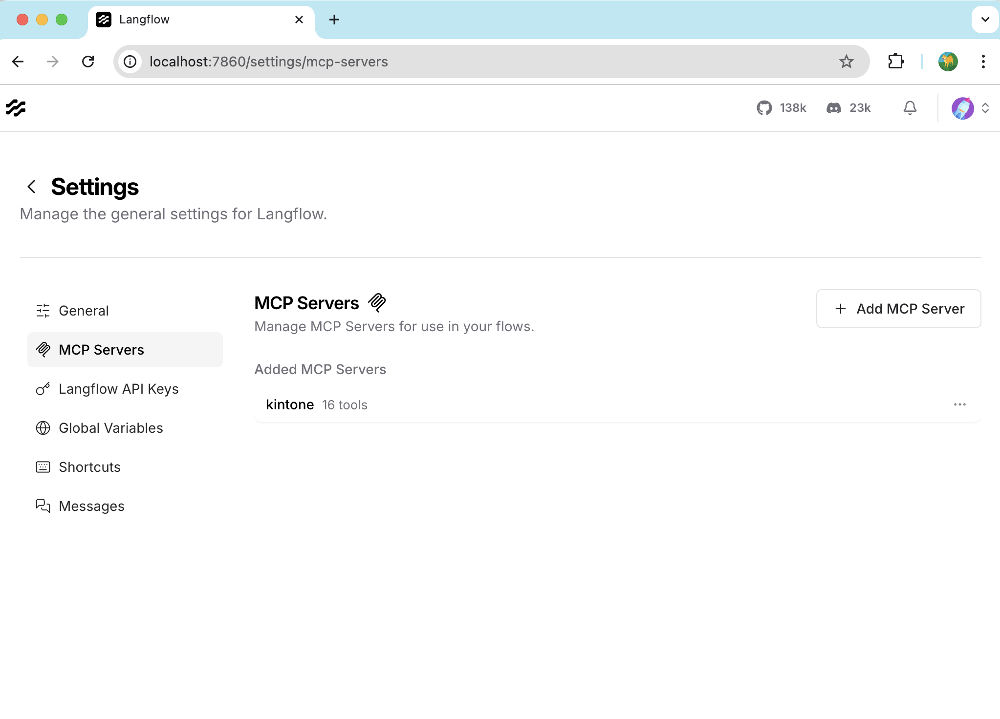
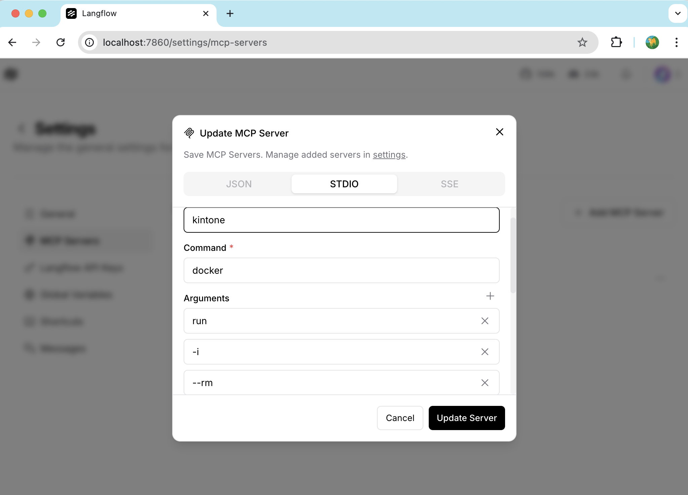
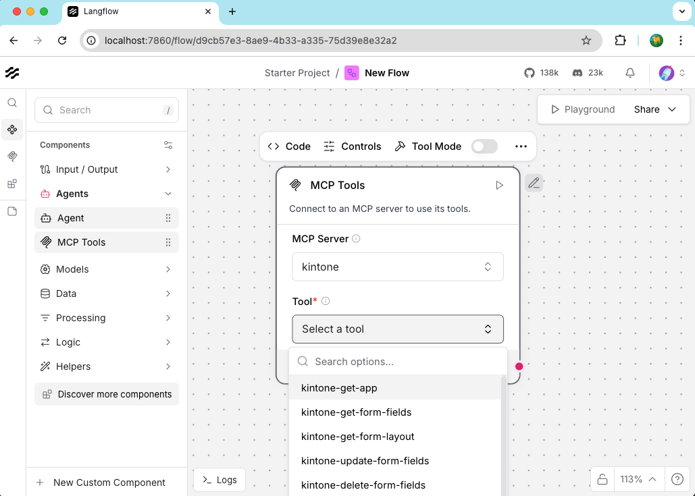
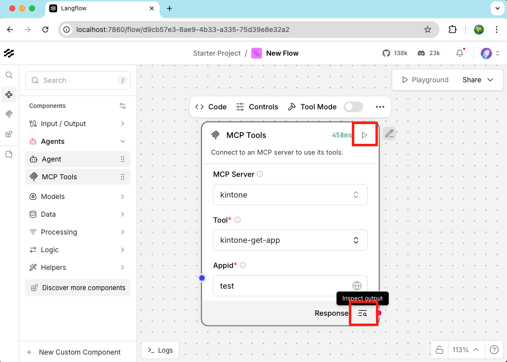
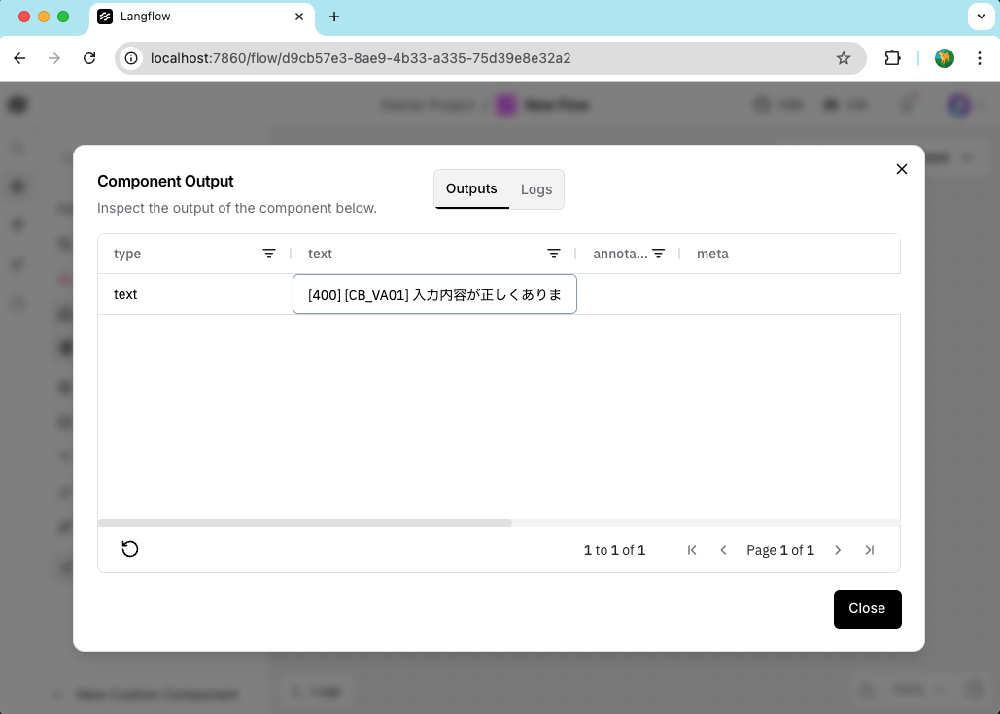
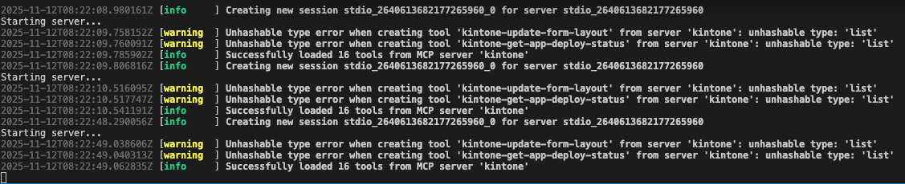

# Langflow 1.6.5 インストール・実行マニュアル
    このマニュアルでは、Langflow 1.6.5のインストールから実行までの手順を説明します。

## for IBM Buisiness Partners only

## Langflowとは
  Langflowは、LangChainのコンポーネントを簡単に使用するためのUIを提供するオープンソースのフレームワークです。LangChainは、大規模言語モデル（LLM）アプリケーションを構築するためのフレームワークであり、Langflowはそのコンポーネントを視覚的に接続して実験できるインターフェースを提供します。

  主な特徴：
  - ドラッグ＆ドロップでLLMアプリケーションを作成
  - コンポーネントを視覚的に接続して複雑なワークフローを構築
  - LangChainのプロンプト、チェーン、エージェントなど様々なコンポーネントを活用
  - カスタムコンポーネントの作成と再利用
  - APIエンドポイントとしてフローをエクスポート可能

  Langflowは、プロトタイピング、実験、学習に最適なツールで、LLMアプリケーション開発を加速します。

### Langflow 1.6.5の主な特徴
  Langflow 1.6.5では以下のような機能が提供されています：

  - **改良されたUI/UX**: より直感的なインターフェースでフローの作成が容易になりました
  - **多様なLLMサポート**: OpenAI、HuggingFace、Mistral、Google Gemini、Anthropic Claude、Groqなど多数のモデルをサポート
  - **フロー管理の強化**: フローの保存、読み込み、エクスポート機能が改善
  - **API機能の強化**: 作成したフローをREST APIとして簡単に公開可能
  - **豊富なコンポーネントライブラリ**: 400以上のLangChainコンポーネントにアクセス可能
  - **レスポンシブデザイン**: モバイルデバイスでの使用も考慮したデザイン
  - **多言語サポート**: 様々な言語モデルと連携可能

## 使用の前提条件
  - VSCodeがインストールされていること
  - Python 3.8以上がインストールされていること
  - MCPサーバがDocker指定の場合は Docker実行環境がインストールされていること

## インストールと実行手順

### 1. 仮想環境の作成
  ```bash
  python -m venv venv
  ```

### 2. 仮想環境の有効化
  ```bash
  source venv/bin/activate
  ```

### 3. Langflowのインストール
  ```bash
  pip install langflow==1.6.5
  ```

  **注意**: インストールには非常に時間がかかることがあります（30分〜1時間以上）。これは、Langflowが多くの依存関係を持ち、それらを解決するのに時間がかかるためです。実際の検証では、依存関係の解決に30分以上かかり、高いCPU使用率（約98%）が継続的に観測されました。

  インストールの過程で約500以上のパッケージがインストールされることがあります。これは通常のPythonパッケージよりもはるかに多く、そのためインストール時間が長くなります。

  インストール中、特に以下のような依存関係で時間がかかる場合があります：

  - langchain とその関連パッケージ
  - google-cloud-aiplatform など、大きなライブラリ
  - 様々なAIモデル連携用のSDK

  インストール中に進行が止まったように見える場合でも、バックグラウンドでは依存関係の解決が行われている可能性があります。辛抱強く待ちましょう。

### 4. Langflowの実行
  ```bash
  langflow run --log-level debug
  ```

  デフォルトでは、Langflowは http://localhost:7860 でアクセスできます。

## Langflowの基本的な使い方

  Langflowを起動すると、ウェブブラウザでインターフェースにアクセスできます。以下は基本的な使い方です：

  

### 新しいフローの作成

  1. ホーム画面の「+ Create Flow」ボタンをクリックします
  2. 左側のサイドバーから使用したいコンポーネントをキャンバスにドラッグ＆ドロップします
  3. コンポーネント間を接続して、データの流れを定義します
  4. コンポーネントをクリックして、パラメータを設定します

### よく使用されるコンポーネント

  - **LLMs**: ChatOpenAI, HuggingFaceHub など
  - **Prompts**: PromptTemplate, ChatPromptTemplate など
  - **Memory**: ConversationBufferMemory など
  - **Chains**: LLMChain, ConversationChain など
  - **Agents**: AgentExecutor など
  - **Tools**: 様々なツールコンポーネント

### フローの保存と読み込み

  - 右上の「Save」ボタンでフローを保存できます
  - 「Export」ボタンでJSONとしてエクスポートできます
  - ホーム画面から保存したフローを読み込めます

## トラブルシューティング
  インストール中に問題が発生した場合は、以下を試してみてください：

### インストール関連の問題

  - pip を最新バージョンにアップデート: `pip install --upgrade pip`
  - 依存関係の競合がある場合は、新しい仮想環境を作成してやり直す
  - インストールが途中で止まった場合は、`--no-cache-dir`オプションを使用してみる:
    ```bash
    pip install langflow==1.6.5 --no-cache-dir
    ```
  - 特定の依存関係でエラーが発生する場合は、まず基本的な依存関係をインストールしてから試す:
    ```bash
    pip install langchain langchain-core langchain-community
    pip install langflow==1.6.5
  ```

### 実行時の問題

  - ポートが既に使用されている場合は、別のポートを指定して実行:
    ```bash
    langflow run --port 7861 --log-level debug
    ```
  - メモリ不足エラーが発生した場合は、大きなモデルの読み込みを避ける設定を検討

## パッチ適用手順

  langflow 1.6.5には既知の問題があり、そのままでは正常に動作しない場合があります。以下のパッチ適用手順に従って修正することができます。
  * MCPサーバ側がList形式でTools一覧を返す場合 設定できない
  * MCPサーバの設定画面でUpdateボタンでenvの値が消えてしまう。

#### 環境により ".venv/lib/python3.11"等のPathは異なります

### 1. バックアップの作成

  まず、修正対象のファイルのバックアップを作成します：

  ```bash
  # utilのバックアップ
  cp .venv/lib/python3.11/site-packages/langflow/base/mcp/util.py venv/lib/python3.11/site-packages/langflow/base/mcp/util.py.bak

  # mcpのバックアップ
  cp .venv/lib/python3.11/site-packages/langflow/api/v2/mcp.py venv/lib/python3.11/site-packages/langflow/api/v2/mcp.py.bak
  ```

### 2. パッチファイルの適用

  パッチファイルを適用します：

  ```bash
  # util.pyの修正
  cp patch_for_langflow1.6.5/base/mcp/util.py .venv/lib/python3.11/site-packages/langflow/base/mcp/util.py

  # mcp.pyも修正
  cp patch_for_langflow1.6.5/api/v2/mcp.py .venv/lib/python3.11/site-packages/langflow/api/v2/mcp.py
  ```

## MCPサーバー設定とツールの利用

  * Langflowでは設定画面からMCPサーバーを追加・管理できます：
    

  * MCPサーバー設定画面では、サーバーの追加・編集・削除が可能です：
    

  * 設定したMCPサーバーのツールは、フロー編集画面にMCPToolsを置くことで利用できます：
    

  * 右上の実行ボタンで選んだToolが実行されます。右下の結果ボタンでレスポンスを確認できます。
    

  * ツールを実行すると、結果が表示されます：
    

  * VSCode上にLogが出力されます：
    

## データベース修正手順

  Langflow 1.6.5では、データベースの問題を修正するための`migration`コマンドが提供されています。データベース関連のエラーやフローの読み込み問題が発生した場合は、以下のコマンドを実行してみてください：

  ```bash
  # データベースの修正を実行
  langflow migration --fix
  ```

  このコマンドは以下のような問題に対処します：
  - データベーススキーマの不整合の修正
  - 古いバージョンからのフローデータの互換性問題の解決
  - 破損したデータベースレコードの修復

  コマンド実行後、Langflowを再起動して問題が解決されたか確認してください：

  ```bash
  langflow run --log-level debug
  ```

## よくある質問（FAQ）

### Q: インストールに時間がかかりすぎるのですが？
  A: langflowは多くの依存関係があり、特に初回インストール時は時間がかかります。依存関係の解決と特に大きなライブラリのダウンロードに時間がかかることがあります。辛抱強く待ちましょう。

### Q: 「No module named 'xxx'」というエラーが出ます
  A: 仮想環境が有効になっているか確認してください。また、必要なモジュールが不足している場合は個別にインストールしてみてください：
  ```bash
  pip install xxx
  ```

### Q: 起動後にブラウザが開きません
  A: 手動でブラウザを開き、http://localhost:7860 にアクセスしてみてください。それでも接続できない場合は、ポートが別のアプリケーションで使用されている可能性があります。

### Q: APIキーの設定はどこで行いますか？
  A: LLMsなどのコンポーネントを使用する際に、各コンポーネントのパラメータとしてAPIキーを設定できます。または環境変数として設定することもできます。

### Q: GPUを使用できますか？
  A: はい、適切な環境設定がされていれば、Langflowは対応するAIモデルでGPUを活用できます。ただし、これには追加の設定が必要な場合があります。

## 参考リソース

  Langflowの使い方や詳細情報を知りたい場合は、以下のリソースが参考になります：

  - [公式GitHub](https://github.com/logspace-ai/langflow) - 最新の更新情報やドキュメント
  - [公式ドキュメント](https://docs.langflow.org) - 詳細なガイドと解説
  - [LangChainドキュメント](https://python.langchain.com/docs/get_started/introduction) - LangChainの基本概念理解に
  - [Langflow Discordコミュニティ](https://discord.com/invite/EqksyE2EX9) - 質問や情報交換

## 注意事項

  - APIキー（OpenAI、HuggingFace等）は個別に取得する必要があります
  - ローカルで実行する場合、セキュリティ機能は限定的です。本番環境での使用には適切なセキュリティ対策を検討してください
  - オープンソースプロジェクトのため、バージョンによって機能や挙動が変わる可能性があります