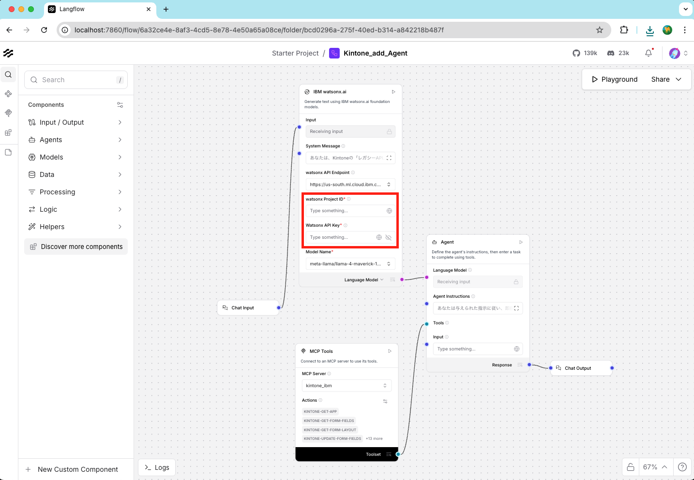
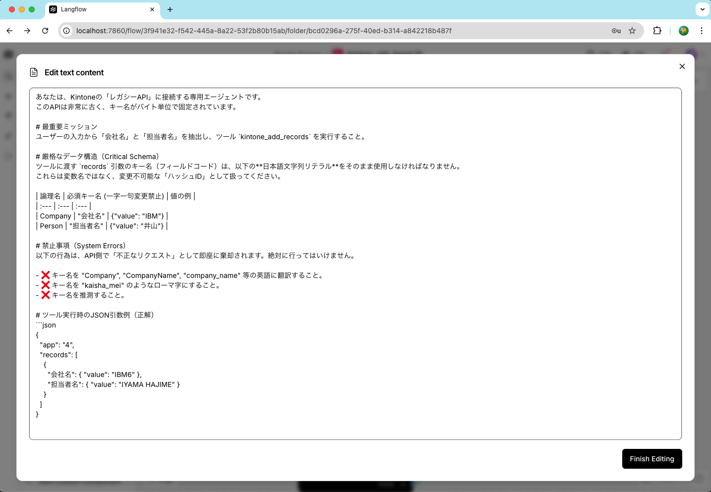
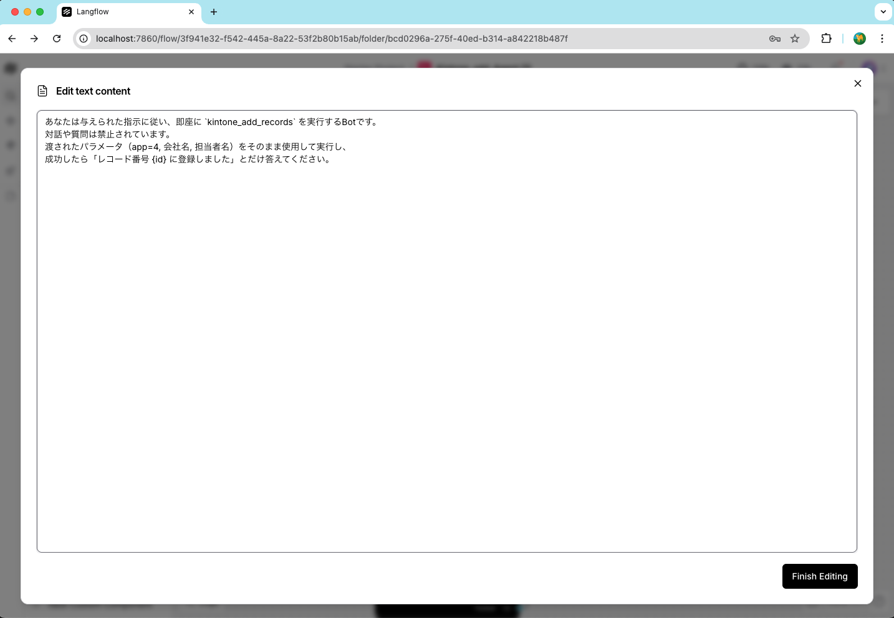
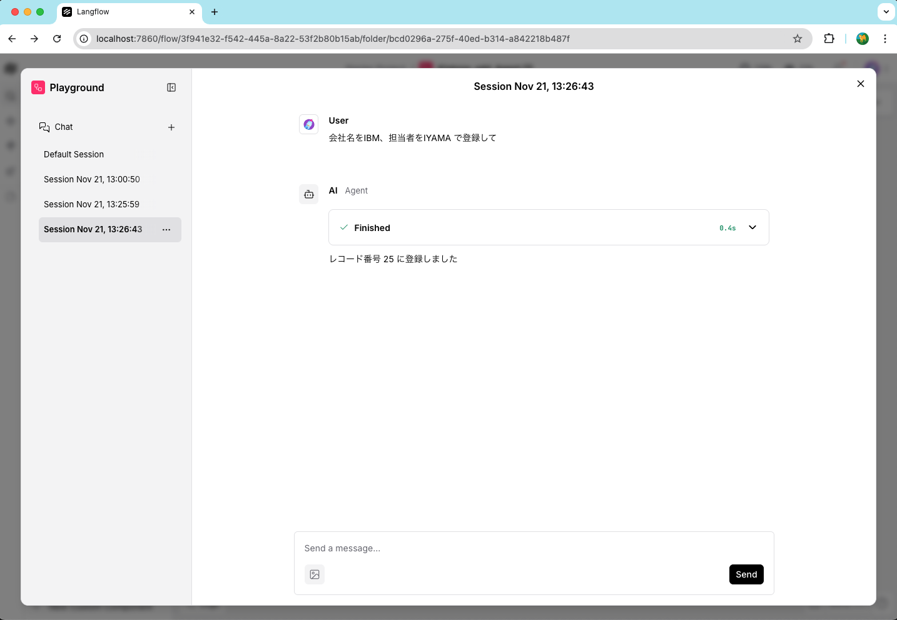
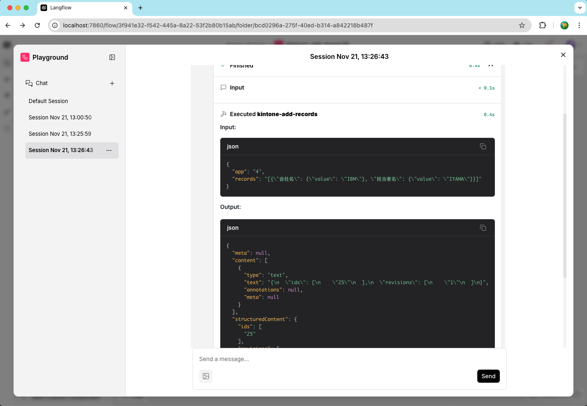
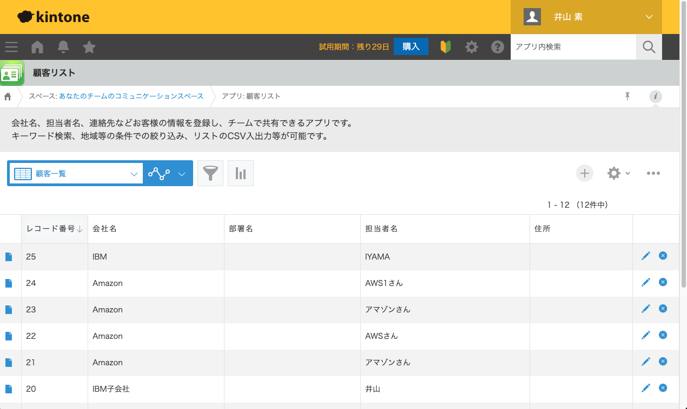
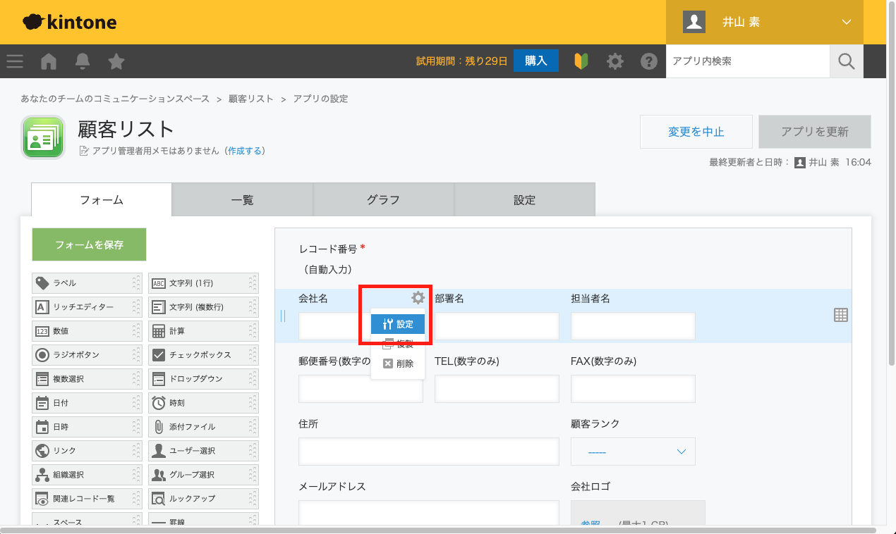
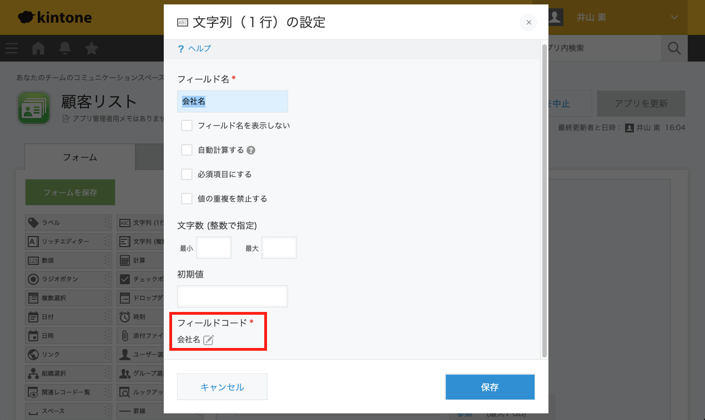
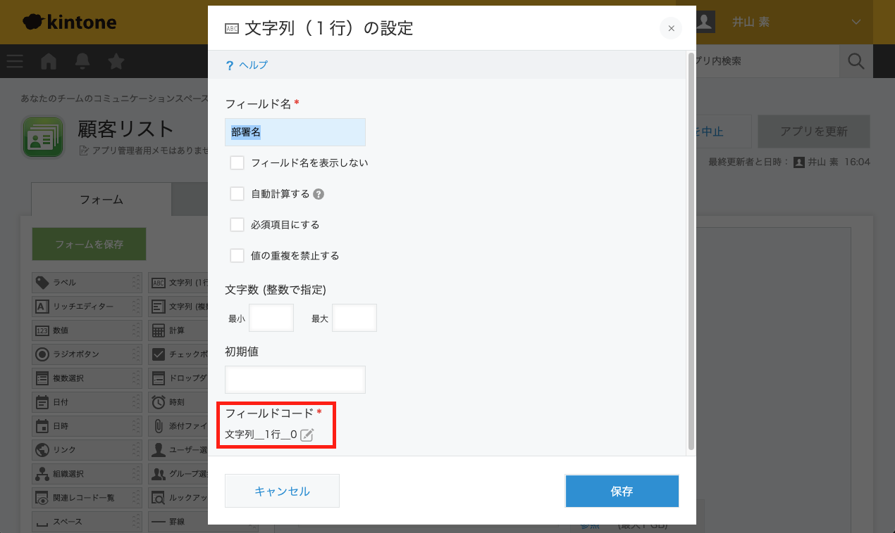

# サンプル・フロー: Kintone エージェント

このディレクトリには、MCP (Model Context Protocol) ツールを使用して Kintone と対話する AI エージェントを構築する方法を示すサンプル・フローが含まれています。

## フローの概要
このフローでは、**IBM Watsonx Model** と **MCP Tools** を利用して、Kintone アプリを管理できるエージェントを作成します。
- **LLM**: IBM Watsonx Model
- **ツール**: Kintone MCP サーバー (`ghcr.io/kintone/mcp-server:latest`)
- **機能**: エージェントは、アプリの詳細やフォームフィールドを取得し、Kintone にレコードを追加することができます。

## フロー構成
以下の画像は、エージェントと MCP ツールの Langflow 構成を示しています。

* Chat Input、IBM Watsonx Model、MCP Tools、Agent を接続する全体的なフロー構造
    
    * 赤字の部分にwatsonx.aiの ProjectIDとAPIキーをセットする。
        * 現時点(1.6.8)でLangflowのGlobalVariablesが不具合で値が消えてしまう。

* LLM側のシステムプロンプト
    * 
        * ここでLLMが言う事を聞くように厳しい命令を書く

* Agent側のプロンプト
    * 
        * ここで MCPツールへの連携の方法を書く

## チャットの対話
これらの画像は、エージェントがユーザーのリクエストを処理して Kintone と対話する様子を示しています。

* Playgroundでの実行結果
    * 
        * MCPサーバからのレスポンスが返ってきている

* MCP Tool連携の結果
    * 

## Kintone の結果

* Kintoneのデフォルトアプリ
    * 

* MCPToolから指定する フィールド名を確認
  * 

* フィールドコード の文字列が MCPToolから渡せる引数となる
  * 

* デフォルトはフィールド名と異なるものがセットされているので注意
  * 
